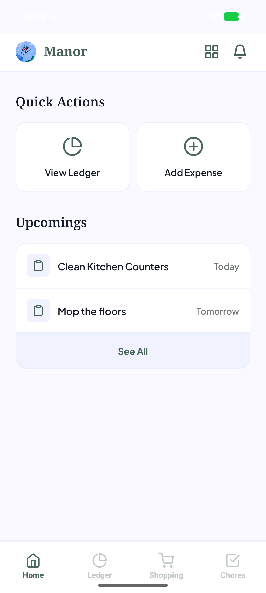
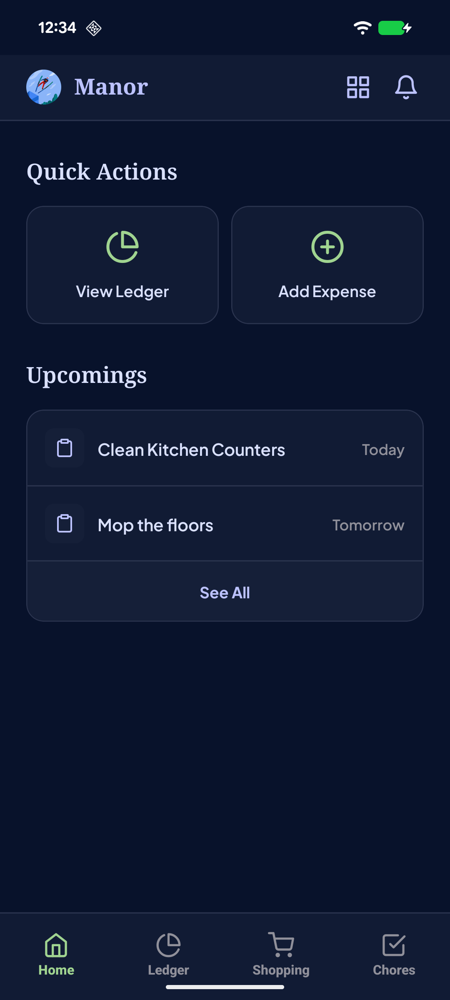
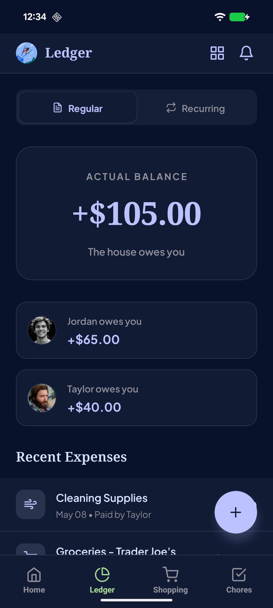
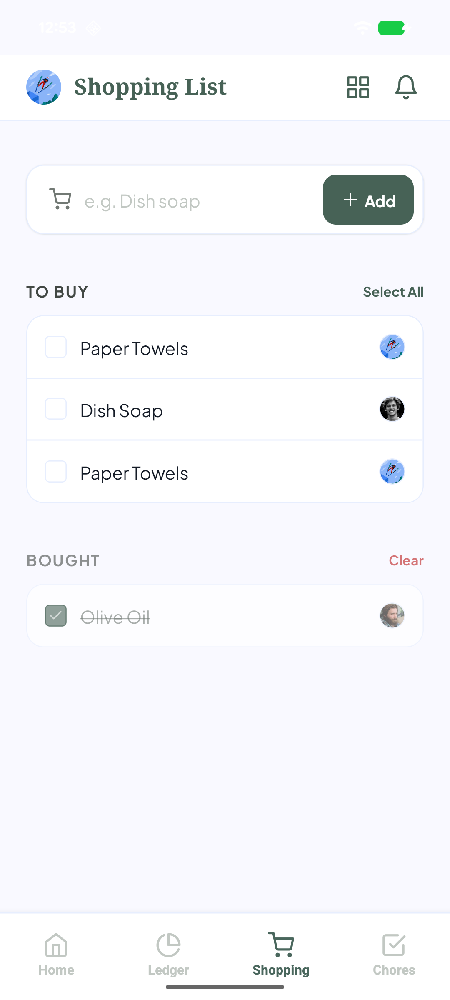
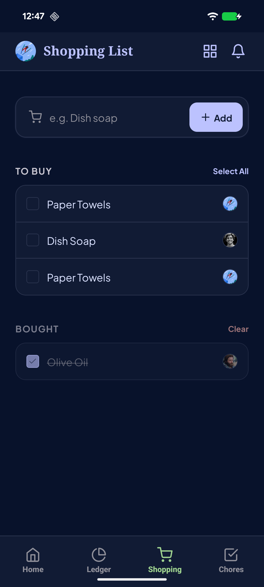
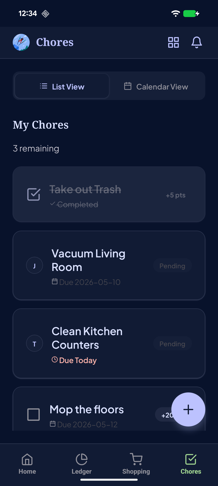

# Manor - Shared Living Management

Manor is a comprehensive tool built to manage shared living spaces effortlessly. Below is a visual showcase of the application across both Light and Dark themes, highlighting the newly updated Chores, Ledger, and Shopping pages!

## App Screenshots

### Home Dashboard
Provides a unified view of your upcoming chores, unpaid expenses, and household notifications.

| Light Theme | Dark Theme |
|:---:|:---:|
|  |  |

### Ledger & Expenses
Tracks who owes who and instantly settles shared household expenses.

| Light Theme | Dark Theme |
|:---:|:---:|
|  |  |

### Shared Shopping List
A synchronized shopping list to coordinate household purchases before they happen.

| Light Theme | Dark Theme |
|:---:|:---:|
|  |  |

### Chores & Tasks
Keep track of household responsibilities and points!

| Light Theme | Dark Theme |
|:---:|:---:|
|  |  |

### Chore Details
Tap into any chore to view its specific details, assignee, point value, and history.

| Light Theme | Dark Theme |
|:---:|:---:|
|  |  |

### Point & Deadline Renegotiation
Need more time? Think the chore is harder than it looks? Instantly request a deadline or point renegotiation from your roommates directly within the app.

| Light Theme | Dark Theme |
|:---:|:---:|
|  |  |
